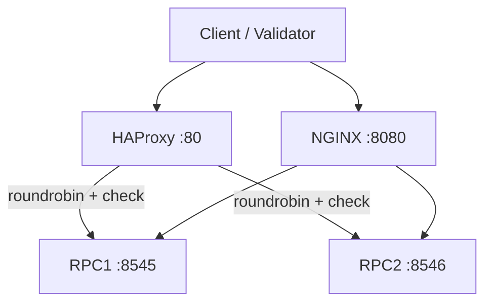

# rpc-routing-toolkit

**Production-inspired High Availability RPC Routing Toolkit demonstrating HAProxy, NGINX, health checks, load balancing, and failover patterns for Ethereum RPC endpoints.**


## Professional Summary

Reference HAProxy and NGINX configurations for resilient RPC access: round-robin balancing, active health checks (`check`), configurable upstreams. Docker Compose demo with volume-mounted configs. Patterns for Kubernetes ConfigMap + Deployment. Demonstrates production HA and failover for Ethereum node fleets without client changes.

## Table of Contents

- [Problem Statement](#problem-statement)
- [Why This Exists](#why-this-exists)
- [Solution Overview](#solution-overview)
- [Key Features](#key-features)
- [Architecture](#architecture)
- [Technology Stack](#technology-stack)
- [Repository Structure](#repository-structure)
- [Deployment Workflow](#deployment-workflow)
- [Monitoring & Observability](#monitoring--observability)
- [Security Considerations](#security-considerations)
- [Operational Lessons Learned](#operational-lessons-learned)
- [Screenshots](#screenshots)
- [Roadmap](#roadmap)
- [Business Value](#business-value)
- [Resume Relevance](#resume-relevance)
- [License](#license)

## Problem Statement

RPC providers and validators need resilient access to Ethereum nodes. Single endpoints create single points of failure. Traffic spikes, node restarts, and regional issues require automatic failover, load distribution, and health-based routing without client changes.

## Why This Exists

Ethereum infrastructure relies on multiple RPC backends for availability. Manual load balancing or DNS failover is fragile. This provides a config-driven, health-checked reference for HA RPC routing at the edge.

## Solution Overview

HAProxy frontend (:80) with roundrobin backend and `check` probes (example: rpc1:8545, rpc2:8546). NGINX reverse proxy (:8080) with upstream. Configs (haproxy.cfg, nginx.conf) mounted as volumes for iteration. Compose demo. Kubernetes ConfigMap patterns for prod.

## Key Features

- HAProxy frontend on :80 with roundrobin backend and `check` health probes
- NGINX reverse proxy on :8080 with upstream config
- Config-driven upstreams (haproxy.cfg, nginx.conf) with volume mounts
- Health checks on backends (rpc1:8545, rpc2:8546 example)
- Docker Compose demo for local HA/failover testing
- Kubernetes deployment patterns via ConfigMap for cfg

## Architecture



### Component Breakdown

- **Ingress**: HAProxy (port 80) and NGINX (8080) as edge proxies
- **Service**: Configurable backends with health checks; upstream RPCs
- **Storage**: Read-only config mounts (haproxy.cfg, nginx.conf); no data persistence
- **Monitoring**: Built-in health checks and access logs; extend with Prometheus exporter
- **Deployment flow**: `docker compose up`; k8s with ConfigMap for cfg files

## Technology Stack

- **Load Balancer**: HAProxy (frontend, backend, balance, checks)
- **Reverse Proxy**: NGINX
- **Packaging**: Docker, Compose
- **Config**: Volume mounts for haproxy.cfg / nginx.conf
- **Orchestration**: Kubernetes (ConfigMap + Deployment patterns)

## Repository Structure

```
rpc-routing-toolkit/
├── docker-compose.yml
├── haproxy.cfg               # frontend http_front, backend rpc_back roundrobin + checks
├── nginx.conf
├── diagrams/request-flow.mmd
├── screenshots/              # architecture.png, failover-flow.png, request-flow.png
├── docs/                     # runbook.md, troubleshooting.md
├── SECURITY.md
├── .github/workflows/ci.yml  # validate + docker
└── ROADMAP.md
```

## Deployment Workflow

```bash
git clone https://github.com/blockmalhotra/rpc-routing-toolkit
cd rpc-routing-toolkit
docker compose up
# Test routing
curl http://localhost:80
curl http://localhost:8080
```

See haproxy.cfg and nginx.conf for upstream customization. k8s patterns use ConfigMap to mount configs.

## Monitoring & Observability

- HAProxy stats and health check logs
- NGINX access/error logs
- Extend with Prometheus exporter for request rates, backend health, latency

## Security Considerations

- Rate limiting and basic auth patterns (extend in cfg)
- No secrets in default configs
- See SECURITY.md

## Operational Lessons Learned

- Explicit health checks (`check`) on backends required for automatic removal of unhealthy RPC nodes.
- Config volume mounts allow zero-downtime cfg changes in dev; same pattern maps to k8s ConfigMap.
- Dual-proxy (HAProxy + NGINX) reference covers both L4/L7 and static/caching use cases common in RPC infra.

## Screenshots

### Request & Failover Flow


### Architecture


## Roadmap

### Completed

- HAProxy + NGINX reference configs with health checks and roundrobin
- Docker Compose demo
- Request flow diagram
- Initial CI
- v0.1.0-in-progress tag and portfolio standardization

### In Progress

- Documentation polish and cross-portfolio consistency
- Runbook references

### Planned

- Prometheus exporter sidecar
- Rate limiting + auth examples
- Kubernetes production manifests with ConfigMap + Ingress
- Failover benchmarking harness

## Business Value

Improves RPC endpoint availability through automatic failover and health-based routing. Reduces client impact from node restarts or regional outages. Standardizes HA patterns for Ethereum infrastructure teams. Enables faster recovery and better uptime for dependent services (validators, dapps).

## Resume Relevance

This repository demonstrates practical experience with:

- High Availability Design (roundrobin, health checks, failover)
- Load Balancing & Proxy (HAProxy, NGINX, upstream config)
- Kubernetes Operations (ConfigMap, Deployment patterns)
- Infrastructure as Code (config-driven, volume mounts)
- Production Troubleshooting (logs, health probes, runbooks)
- DevOps Tooling (Docker, Compose, CI)

## License

MIT License. See [LICENSE](LICENSE).

---

Reference implementation. Evidence from repository code and manifests only.
