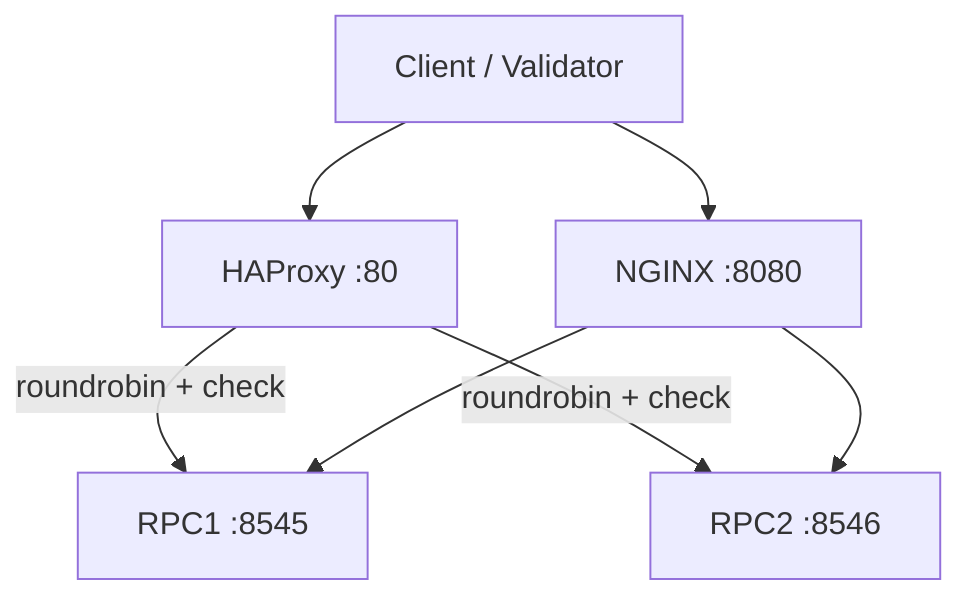
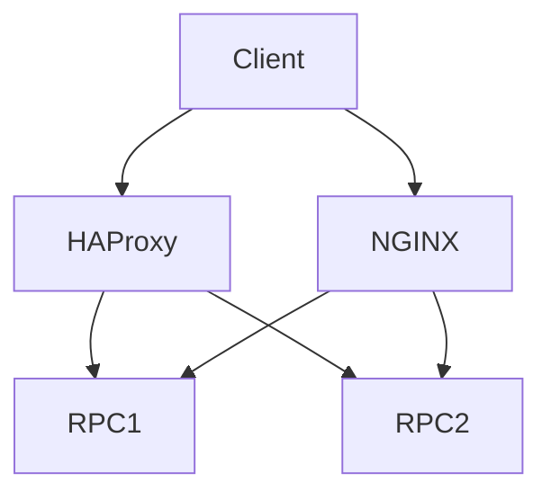

# rpc-routing-toolkit

High availability RPC routing toolkit using HAProxy and NGINX for load balancing, health checks, failover, and rate limiting across multiple upstream Ethereum RPC endpoints.


**Overview** | [Architecture](#architecture) | [Features](#features) | [Deployment](#deployment) | [Monitoring](#monitoring) | [Security](#security) | [Screenshots](#screenshots)

## Problem Statement

RPC providers and validators need resilient access to Ethereum nodes. Single endpoints create single points of failure. Traffic spikes, node restarts, and regional issues require automatic failover, load distribution, and health-based routing without client changes.

## Solution

Reference HAProxy and NGINX configurations implement round-robin balancing, active health checks, and configurable upstreams. Docker Compose demonstrates the edge proxies. Config volume mounts enable rapid iteration. Patterns extend to Kubernetes ConfigMap + Deployment for production RPC fleets.

## Features

- HAProxy frontend on :80 with roundrobin backend and `check` health probes
- NGINX reverse proxy on :8080 with upstream config
- Config-driven upstreams (haproxy.cfg, nginx.conf) with volume mounts
- Health checks on backends (rpc1:8545, rpc2:8546 example)
- Docker Compose demo for local HA/failover testing
- Kubernetes deployment patterns via ConfigMap for cfg

## Technology Stack

- **Load Balancer**: HAProxy (frontend, backend, balance, checks)
- **Reverse Proxy**: NGINX
- **Packaging**: Docker, Compose
- **Config**: Volume mounts for haproxy.cfg / nginx.conf
- **Orchestration**: Kubernetes (ConfigMap + Deployment patterns)

## Architecture



### Component Breakdown

- **Ingress**: HAProxy (port 80) and NGINX (8080) as edge proxies
- **Service**: Configurable backends with health checks; upstream RPCs
- **Storage**: Read-only config mounts (haproxy.cfg, nginx.conf); no data persistence
- **Monitoring**: Built-in health checks and access logs; extend with Prometheus exporter
- **Deployment flow**: `docker compose up`; k8s with ConfigMap for cfg files

<details>
<summary>Show request-flow.mmd</summary>


</details>

## Repository Structure

```
rpc-routing-toolkit/
├── docker-compose.yml
├── haproxy.cfg               # frontend http_front, backend rpc_back roundrobin + checks
├── nginx.conf
├── diagrams/request-flow.mmd
├── screenshots/              # architecture.png, failover-flow.png, request-flow.png
├── docs/                     # runbook.md, troubleshooting.md
├── SECURITY.md
├── .github/workflows/ci.yml  # validate + docker
└── ROADMAP.md
```

## Screenshots

### Request & Failover Flow


### Architecture


## Deployment

```bash
git clone https://github.com/blockmalhotra/rpc-routing-toolkit
cd rpc-routing-toolkit
docker compose up

# Test routing
curl http://localhost:80
curl http://localhost:8080
```

See haproxy.cfg and nginx.conf for upstream customization. k8s patterns use ConfigMap to mount configs.

## Monitoring

- HAProxy stats and health check logs
- NGINX access/error logs
- Extend with Prometheus exporter for request rates, backend health, latency

## Security

- Rate limiting and basic auth patterns (extend in cfg)
- No secrets in default configs
- See SECURITY.md

## CI/CD

`.github/workflows/ci.yml`:

- validate: `docker compose config --quiet`
- build: docker validation

## Roadmap

### Completed

- HAProxy + NGINX reference configs with health checks and roundrobin
- Docker Compose demo
- Request flow diagram
- Initial CI
- v0.1.0-in-progress tag and portfolio standardization

### In Progress

- Documentation polish and cross-portfolio consistency
- Runbook references

### Planned

- Prometheus exporter sidecar
- Rate limiting + auth examples
- Kubernetes production manifests with ConfigMap + Ingress
- Failover benchmarking harness

## Lessons Learned

- Explicit health checks (`check`) on backends are required for automatic removal of unhealthy RPC nodes.
- Config volume mounts allow zero-downtime cfg changes in dev; same pattern maps to k8s ConfigMap.
- Dual-proxy (HAProxy + NGINX) reference covers both L4/L7 and static file / caching use cases common in RPC infra.

## License

MIT License. See [LICENSE](LICENSE).

---

**Reference implementation and learning project. Not production deployment.**
