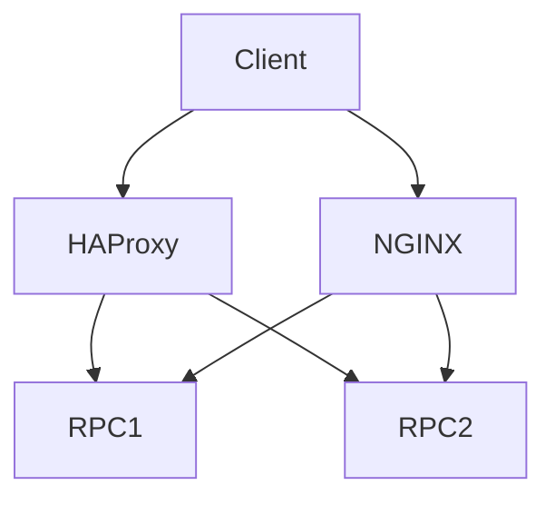

# rpc-routing-toolkit

HA Blockchain RPC Platform.

## Problem
RPC endpoints need HA, failover, rate limit to avoid downtime.

## Architecture

## Components
HAProxy, NGINX, health checks.

## Quick Start
docker compose up

## Demo
See docker-compose.yml

## Screenshots
screenshots/request-flow.png etc.

## Monitoring
Health checks, logs.

## Security
Rate limit.

## CI/CD
.github/workflows/ci.yml

## Production Deployment
k8s ingress.

## Roadmap
- More backends

## Runbooks
docs/runbook.md

## Troubleshooting
docs/troubleshooting.md
