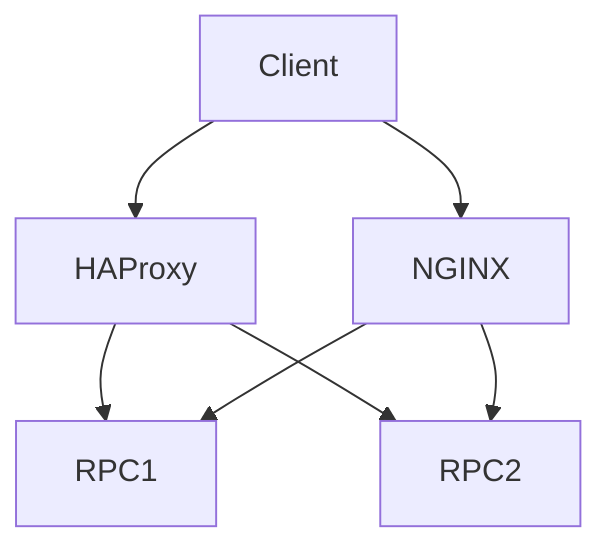

# rpc-routing-toolkit

🚧 Status: In Progress

This repository is currently under active development.
It represents a reference implementation and learning project.
Features and architecture may change before stable release.


## Features

- HAProxy + NGINX reference configs for RPC load balancing and failover
- Health checks, rate limiting, multi-upstream routing
- Docker compose demo
- Real haproxy.cfg / nginx.conf with frontends/backends

## Architecture



### Component Breakdown

- **Ingress**: HAProxy (port 80) and NGINX (8080) as edge proxies
- **Service**: Backend RPC upstreams (configurable); health checks on / 
- **Storage**: Config volume mounts (haproxy.cfg, nginx.conf); no persistent data
- **Monitoring**: Built-in health checks, logs; extend with prom exporter
- **Deployment flow**: docker compose up; k8s deployment with configmap for cfg in prod

## Quick Start

```bash
git clone https://github.com/blockmalhotra/rpc-routing-toolkit
cd rpc-routing-toolkit
docker compose up
# HAProxy: localhost:80 ; NGINX: localhost:8080
```

## Roadmap

### v0.1
- Initial release

### v0.2
- Feature expansion

### v0.3
- Production hardening

### v1.0
- Stable release

## Contributing

See CONTRIBUTING.md

## License

MIT License - see LICENSE file.

## Problem
Blockchain infrastructure requires production patterns for deployment, monitoring, routing and secrets.

## Components
- Docker compose for local demo
- Kubernetes manifests (StatefulSet, Service, ConfigMap, Secret)
- Observability (Prometheus, Grafana, Loki, Tempo)
- GitOps ready

## Monitoring
Prometheus metrics, Grafana dashboards, logs and traces via Loki/Tempo.

## Security
No real credentials. Secrets use CHANGEME or valueFrom. RBAC, no keys in images.

## CI/CD
.github/workflows/ci.yml: validate (compose), build (docker).

## Troubleshooting
See docs/troubleshooting.md
